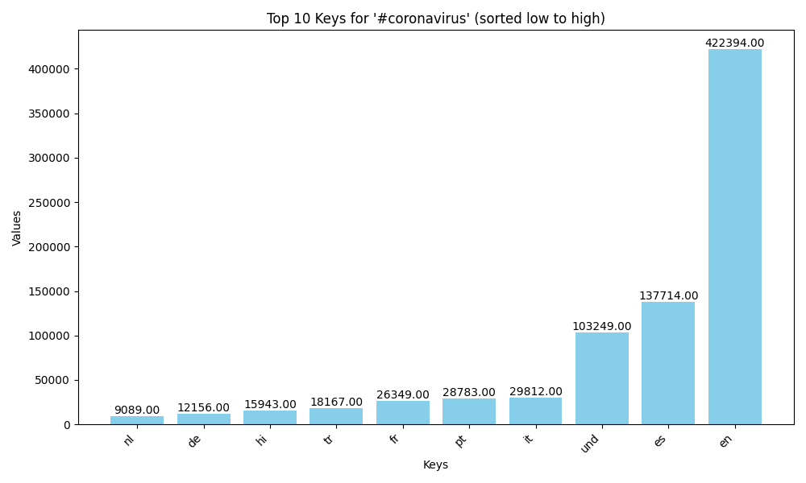
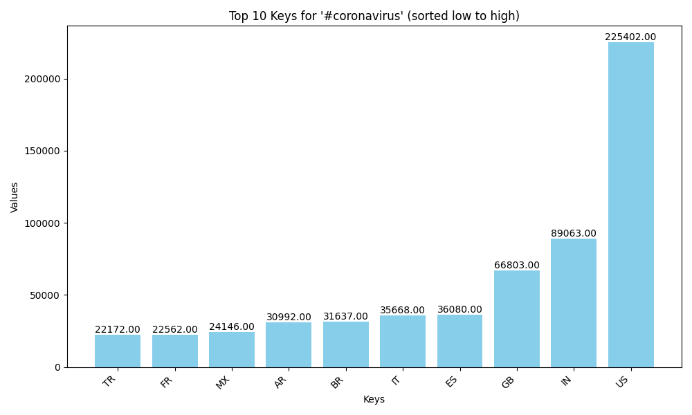
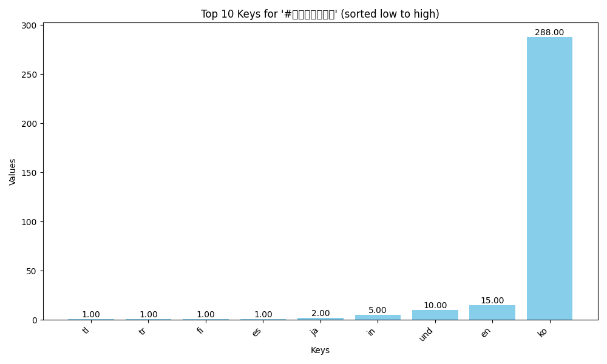
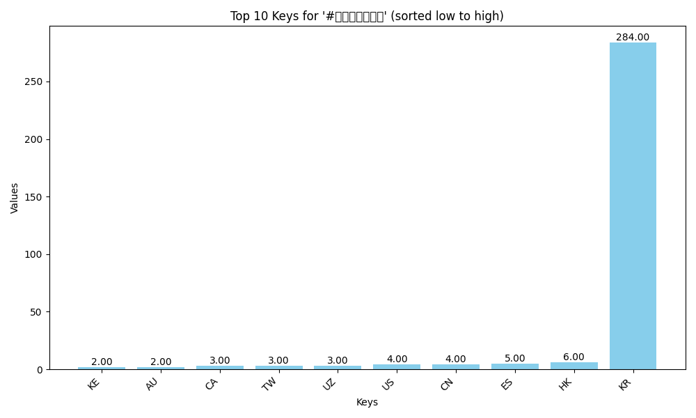
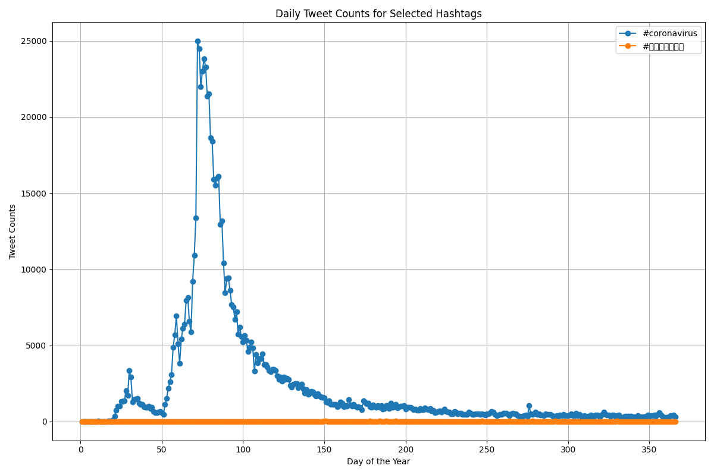

# Twitter Coronavirus Analysis

This project processes a large Twitter dataset to capture tweet counts related to COVID-19 hashtags across different languages and countries. The following images summarize the results:

### Bar Graphs
- **Language Data for #coronavirus:**  



- **Country Data for #coronavirus:**  


- **Language Data for #코로나바이러스:**  


- **Country Data for #코로나바이러스:**  


### Alternative Reduce Plot

The alternative reduce script generated a line plot that shows the daily tweet counts for selected hashtags over the course of a year. This plot can be found below:




```markdown

