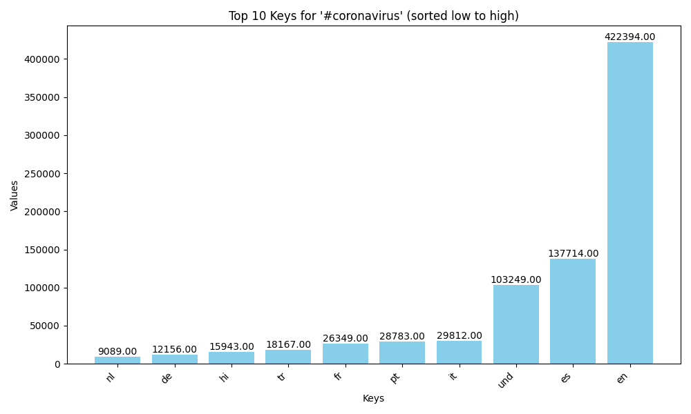
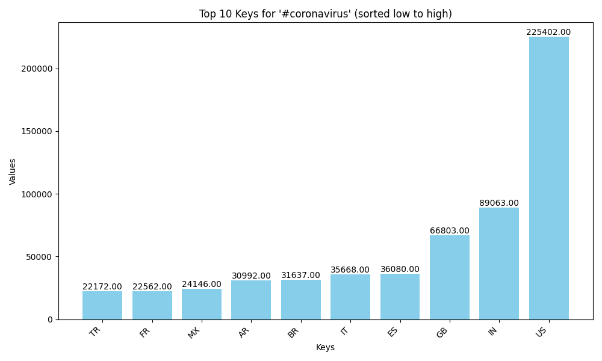
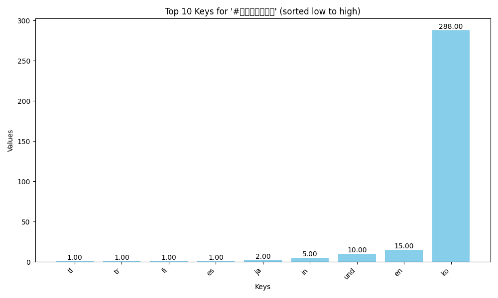
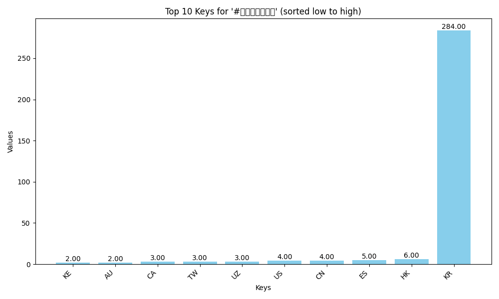

# Twitter Coronavirus Analysis

This project processes a large Twitter dataset to capture tweet counts related to COVID-19 hashtags across different languages and countries. The following images summarize the results:

### Bar Graphs
- **Language Data for #coronavirus:**  
  

- **Country Data for #coronavirus:**  
  

- **Language Data for #코로나바이러스:**  
  

- **Country Data for #코로나바이러스:**  
  

### Alternative Reduce Plot

The alternative reduce script generated a line plot that shows the daily tweet counts for selected hashtags over the course of a year. This plot can be found below:


---

## Project Overview

(Your brief explanation about how the project works, the data processing, mapping, reducing, and visualization.)

*Note:* If the file names contain special characters (like `#`), GitHub might not render them properly in the URL. In that case, you might consider renaming the images to something like `combined_lang_coronavirus.png` (and then updating the references here) or encoding the URL. For example:

```markdown


